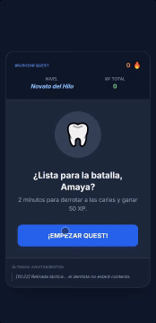

# 🪥 Brushing Quest

> Una aplicación web de gamificación en formato móvil diseñada para transformar el hábito diario de la higiene bucal en una aventura RPG mediante mecánicas de progresión y recompensas.

---

## 🪓 Mecánicas de Gamificación (Behavioral UX)

*   **Sistema de Progresión RPG:** Niveles con títulos personalizados y acumulación de Puntos de Experiencia (XP) al completar los 2 minutos recomendados por dentistas.
*   **Métrica de Racha (Streaks 🔥):** Fomento de la retención y consistencia diaria mediante contadores de días consecutivos.
*   **Registro de Combate Dinámico:** Historial de eventos con tono humorístico para aportar feedback inmediato y feedback situacional ante retiradas o logros.
*   **Diseño 'Mobile-First':** Interfaz limpia en modo oscuro optimizada para uso ágil en dispositivos móviles durante la rutina diaria.

---

## ⚙️ Tecnologías Utilizadas

*   **Frontend:** HTML5, CSS3 (CSS Grid/Flexbox, estilos en modo oscuro).
*   **Lógica de Interacción:** JavaScript (ES6+) para la gestión de temporizadores en tiempo real, cálculo de experiencia y actualización del estado de usuario.
*   **Persistencia:** LocalStorage para mantener el progreso, racha y nivel guardados de forma local.

---

## 🛠️ Desarrollo y Dirección de Arte

Este proyecto fue ideado para explorar cómo la **gamificación ligera** ayuda a combatir la procrastinación en hábitos cotidianos de salud. Utilicé herramientas de IA para agilizar la infraestructura de código y centrar mi trabajo en:

1.  **UX Strategy & Gamificación:** Diseño del bucle de hábito (Disparador -> Acción -> Recompensa Variable -> Inversión).
2.  **UI & Microcopys:** Elección de componentes con alto contraste, tipografía legible y redacción de textos humorísticos para enriquecer la experiencia de usuario.
3.  **Lógica del Temporizador:** Control de tiempo de sesión y gestión de estados (en combate, victoria, retirada táctica).

---

## 🚀 Cómo Ejecutar el Proyecto

Ve a la página [Brushing Quest](https://amaya-muniesa.github.io/brushing-quest/index.html).

## 💡 Posibles mejoras
1. Añadir recompensas por rachas o con monedas de juego para luego gastar en congelador de rachas, u otros cambios como variación en el estilo.
2. Incrustar vídeos o animaciones para explicar cómo lavarse los dientes correctamente.
