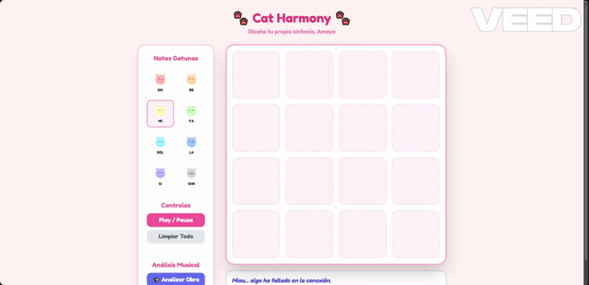

# 🐾 Cat Harmony 

> Una aplicación web interactiva y lúdica que funciona como un secuenciador de música simple, permitiendo a los usuarios componer melodías utilizando notas musicales con temática gatuna.

---

## 🎨 Características Clave

*   **Secuenciador Visual Interactivo:** Cuadrícula intuitiva de 4x4 para la asignación y planificación de notas en tiempo real.
*   **Identidad Visual Cuidada:** Interfaz de usuario (*UI*) diseñada con una estética pastel, limpia y orientada a la experiencia de usuario gamificada (*UX*).
*   **Feedback de Audio Dinámico:** Reproducción interactiva de notas ("Do, Re, Mi...") personalizadas y elementos de control (*Play, Pausa, Limpiar Todo*).
*   **Módulo de Análisis Musical:** Inclusión de funciones lógicas avanzadas integradas en la interfaz para analizar las obras creadas de manera dinámica.

---

## ⚙️ Tecnologías Utilizadas

*   **Frontend:** HTML5, CSS3 (Flexbox/Grid para el diseño adaptativo).
*   **Lógica de Interacción:** JavaScript (ES6+) para la gestión del secuenciador, eventos de audio y estados de la botonera.
*   **Recursos:** Diseño de activos gráficos vectoriales optimizados para entornos web.

---

## 🛠️ Desarrollo Eficiente y Co-creación con IA

Este proyecto ha sido desarrollado aplicando metodologías de **desarrollo ágil** mediante el uso de Modelos de Lenguaje Avanzados (LLMs) para la optimización del código. 

Como diseñadora técnica, mi rol se centró en:
1.  **Dirección de Arte y UI/UX:** Conceptualización visual completa, paleta cromática, tipografías y diseño de componentes de interfaz legibles y accesibles.
2.  **Arquitectura de la Información:** Definición de flujos y jerarquía visual (menú de controles vs. zona de creación musical).
3.  **Lógica del Secuenciador:** Modelado de los requerimientos y control de calidad (*testing*) del comportamiento del bucle de audio y eventos del DOM interactivos.

## 🚀 Cómo Ejecutar el Proyecto

Ve a la página [https://amaya-muniesa.github.io/cat-harmony/index.html].

## 💡 Posibles mejoras

1. **Borrar Nota:** Que permita al usuario el quitar una nota mediante una pequeña "x" o de alguna otra forma que sea sencilla de implementar y usar.
