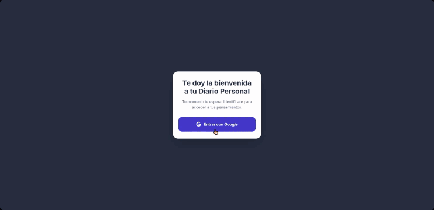

# 📓 Diario Personal 

> Una aplicación web minimalista y segura diseñada para la escritura reflexiva, con un sistema de autenticación de usuarios integrado.

---

## 🎨 Características Clave

*   **Autenticación Segura (OAuth):** Sistema de acceso integrado con Google Sign-In para garantizar la privacidad y seguridad de las entradas de cada usuario.
*   **Diseño Minimalista:** Interfaz de usuario (UI) libre de distracciones, diseñada para fomentar la concentración y la escritura reflexiva.
*   **Gestión de Datos:** Arquitectura de base de datos para almacenar, recuperar y organizar las entradas del diario en tiempo real.
*   **Responsive Design:** Experiencia fluida y adaptable a cualquier dispositivo móvil o de escritorio.

---

## ⚙️ Tecnologías Utilizadas

*   **Frontend:** HTML5, CSS3, JavaScript (ES6+).
*   **Backend & Autenticación:** Firebase Auth.
*   **Base de Datos:** Cloud Firestore.

---

## 🛠️ Enfoque de Desarrollo (UI/UX & IA)

El objetivo de este proyecto era construir una herramienta funcional priorizando la **privacidad y la limpieza visual**. Utilicé Modelos de Lenguaje Avanzados (LLMs) para agilizar la integración del sistema de autenticación y las consultas a la base de datos, lo que me permitió enfocar mis esfuerzos en:

1.  **Diseño de Experiencia (UX):** Reducción de la fricción en el registro/acceso mediante un *login* de un solo clic.
2.  **Arquitectura Visual:** Uso de jerarquías claras, paletas de colores sobrias y *microcopys* empáticos ("Tu momento te espera").
3.  **Seguridad:** Implementación de rutas protegidas para que cada usuario solo tenga acceso a sus propios datos.

---

## 🚀 Cómo Ejecutar el Proyecto

Ve a la página [Diario Personal](https://amaya-muniesa.github.io/diario-personal/index.html).

## 💡 Posibles mejoras
1. Meter más mejoras en la Tienda de Temas, así aprovechar mejor las monedas.
2. Poner alguna otra sección más, como ejercicios de relajación o concentración.